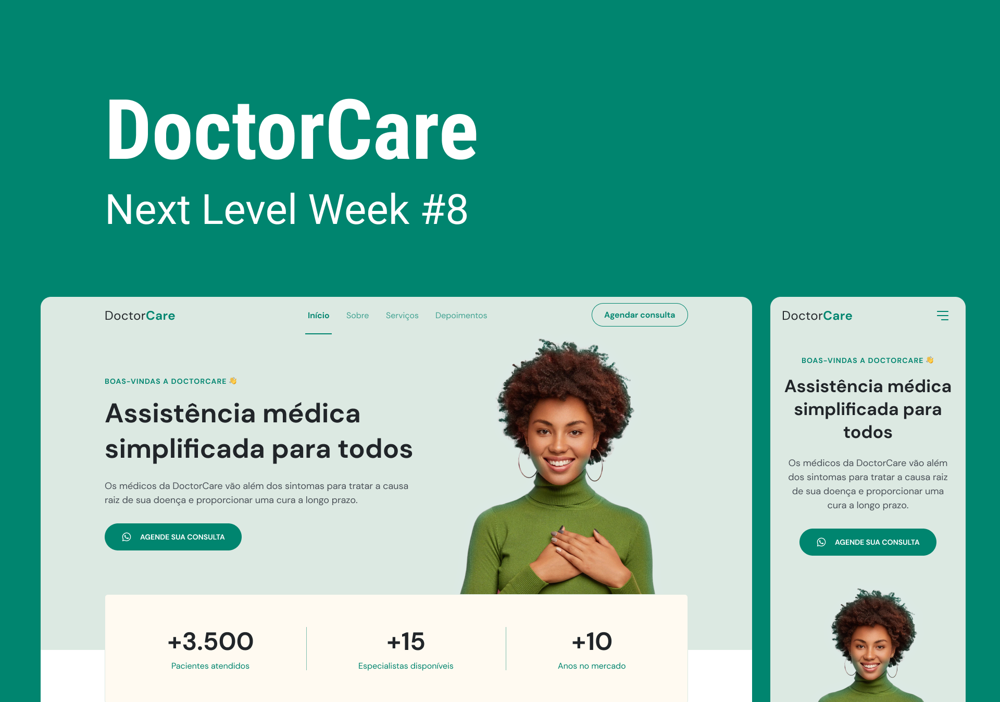

    

<h1 align="center">
	NLW Return Origin by Rockeseat
</h1>

Trilha Origin do Evento Next Level Week Return.

  

  

  

## 🚀 Projeto

DoctorCare um site magnífico e 100% responsivo para agendamento de consulta.

## 🔧 Tecnologias

- HTML 5
- CSS 3
- JavaScript
- ESLint + Prettier + EditorConfig;
- VS Code

---

Feito com ♥ by [Victor Borsatto](https://www.linkedin.com/in/victor-borsatto/)